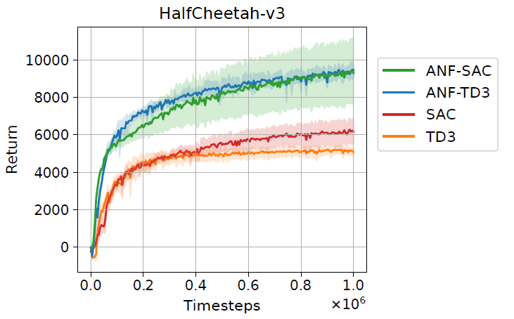

# Sparse Training in Deep RL - Tutorial

This guide is designed for attendees of the [IJCAI](https://ijcai-23.org/tutorials/) 2023 tutorial 
T27: _Sparse Training for Supervised, Unsupervised, Continual, and Deep Reinforcement Learning with Deep Neural Networks_. 
In the following we will play around with some of the settings in our reposity. 
I hope this will give you a feeling for the types of problems we are researching in this field.

Author: [Bram Grooten](https://www.bramgrooten.nl/).

## Install

First `git clone` and install this repository, 
by following the instructions in 
the [README](https://github.com/bramgrooten/automatic-noise-filtering/blob/main/README.md).


## Visualizing a trained agent

We have included a trained agent in the repository already, 
so let's view what this actually looks like! 
Go to this repository's main folder in your terminal 
(the directory with the `view_mujoco.py` file in it), 
make sure your venv is activated, and run:

```
python view_mujoco.py
```

A window should pop up showing you one episode of a running HalfCheetah! 
The camera doesn't track the agent by default, press `TAB` to do that.


The agent is rewarded for moving forward as quickly as possible. See the exact details in the documentation of [MuJoCo Gym](https://gymnasium.farama.org/environments/mujoco/half_cheetah/).

At the bottom of the `view_mujoco.py` file there are some instructions on downloading more of our trained agents, 
if you want to compare a few or look at some agents move in different environments.


## Training sparse neural networks

In this repository you can train a sparse version of [SAC](https://arxiv.org/abs/1801.01290) or [TD3](https://arxiv.org/abs/1802.09477).
Run the script `main.py` as follows:

```
python main.py --policy ANF-SAC --env HalfCheetah-v3 --global_sparsity 0.5 --wandb_mode disabled
```

to train a sparse SAC agent on the HalfCheetah-v3 environment with 50% sparsity. 
The original DS-TD3 and DS-SAC algorithms from [Sokar et al.](https://arxiv.org/abs/2106.04217) (which this repository is based on)
apply **D**ynamic **S**parse Training to show that only using half of the weights 
can actually improve performance over dense models in many environments! 

A training run in reinforcement learning can take quite a while 
(i.e., between 4-24 hours depending on the settings and compute hardware you use).
However, you should be able to see the rewards go up pretty quickly for HalfCheetah. 
Running the above command on my laptop with an NVIDIA Quadro P2000 GPU shows:

```
Total Steps: 1000  Episode Num: 0  Epi. Steps: 1000  Reward: -106.9  Epi. Time: 0:00:38.113582  Total Train Time: 0:01:04.060303
Total Steps: 2000  Episode Num: 1  Epi. Steps: 1000  Reward: -229.72  Epi. Time: 0:00:36.587989  Total Train Time: 0:01:40.648814
Total Steps: 3000  Episode Num: 2  Epi. Steps: 1000  Reward: -254.99  Epi. Time: 0:00:34.820381  Total Train Time: 0:02:15.469734
Total Steps: 4000  Episode Num: 3  Epi. Steps: 1000  Reward: -123.78  Epi. Time: 0:00:36.723802  Total Train Time: 0:02:52.194053
Total Steps: 5000  Episode Num: 4  Epi. Steps: 1000  Reward: -65.56  Epi. Time: 0:00:37.499780  Total Train Time: 0:03:29.694346
---------------------------------------
Evaluation over 5 episode(s): -88.544
---------------------------------------
Total Steps: 6000  Episode Num: 5  Epi. Steps: 1000  Reward: -98.79  Epi. Time: 0:00:54.771722  Total Train Time: 0:04:24.466859
Total Steps: 7000  Episode Num: 6  Epi. Steps: 1000  Reward: -20.56  Epi. Time: 0:00:38.878653  Total Train Time: 0:05:03.346438
Total Steps: 8000  Episode Num: 7  Epi. Steps: 1000  Reward: 261.05  Epi. Time: 0:00:40.444133  Total Train Time: 0:05:43.791106
Total Steps: 9000  Episode Num: 8  Epi. Steps: 1000  Reward: 186.32  Epi. Time: 0:00:39.042627  Total Train Time: 0:06:22.834215
Total Steps: 10000  Episode Num: 9  Epi. Steps: 1000  Reward: 1363.95  Epi. Time: 0:00:37.373520  Total Train Time: 0:07:00.208328
---------------------------------------
Evaluation over 5 episode(s): 1635.536
---------------------------------------
Total Steps: 11000  Episode Num: 10  Epi. Steps: 1000  Reward: 1653.07  Epi. Time: 0:00:48.873239  Total Train Time: 0:07:49.082014
Total Steps: 12000  Episode Num: 11  Epi. Steps: 1000  Reward: 1855.95  Epi. Time: 0:00:34.300092  Total Train Time: 0:08:23.382577
Total Steps: 13000  Episode Num: 12  Epi. Steps: 1000  Reward: 2008.34  Epi. Time: 0:00:37.275500  Total Train Time: 0:09:00.658566
Total Steps: 14000  Episode Num: 13  Epi. Steps: 1000  Reward: 2141.13  Epi. Time: 0:00:39.403169  Total Train Time: 0:09:40.062282
Total Steps: 15000  Episode Num: 14  Epi. Steps: 1000  Reward: 2531.5  Epi. Time: 0:00:41.110036  Total Train Time: 0:10:21.172832
---------------------------------------
Evaluation over 5 episode(s): 3113.252
---------------------------------------
```

After 10 minutes of training we already have an average evaluation return (=sum of rewards) of >3000. 
There is often a lot of variance in RL unfortunately, so the results will probably differ for you. 
We need to run many seeds in RL to get a good indication of an algorithm's performance.

Note that the evaluation returns will almost always be better than the returns during training, 
as the agents often use extra stochasticity during training to boost exploration. 
During evaluation this is turned off, so the expected best action is always selected.

The graph below should give an indication of the expected returns for HalfCheetah-v3. 
Note that the graph is from Figure 5 of the [ANF paper](https://arxiv.org/abs/2302.06548), 
where we used environments with large amounts of noise features. 
Sparse neural networks can help to focus on the task-relevant features, 
but we'll cover that in the section on Automatic Noise Filtering below.




The number of environment steps to train on is set to 1 million by default, 
but you can change this with the argument `--max_timesteps`. 
See the file [utils.py](https://github.com/bramgrooten/automatic-noise-filtering/blob/main/utils/utils.py) 
for all the arguments you can play with, or run `python main.py --help` in the terminal.

To see the code showing how this actually works under the hood, check out the files:
- `main.py`: where the training call is started
- `algorithms/sac_based/anf_sac.py`: to see when we update and apply the sparsity masks
- `utils/sparse_utils.py`: to see how we initialize and update the sparsity masks


Go ahead and try out different values for the `--global_sparsity` and see how that affects the performance. 
There is an interesting paper called "[The State of Sparse Training in Deep RL](https://arxiv.org/abs/2206.10369)" 
that investigated how far sparsity levels can be pushed in Deep RL, 
going all the way to 99%. 
In RL, often the performance stays competitive with fully dense networks until a sparsity level of about 90%.


### Sparsity Distribution

An example of a setting that you can play around with is the 
distribution of sparsity levels over the different layers of your neural network. 
In the simplest setting of Dynamic Sparse Training (DST) we usually have 
a fixed global sparsity level throughout training. 
Also, the sparsity distribution over the layers is usually kept fixed. 
What is always adapted in DST is which weights are currently activated. 

In this repository for RL we often use small MLP networks with 3 layers. 
The hidden layer has 256 neurons on each side. The input layer size depends on the environment, 
and the output layer has either the same number of neurons as the number of actions 
(for the Actor network) or just 1 neuron (for the Critic networks).
We often keep the crucial output layer dense, which especially makes sense for the Critic.

A typical sparsity distribution for a 90% sparse NN in our work would be:

| Layer 1 | Layer 2 | Layer 3 | 
|---------|---------|---------| 
| 90.3%   | 90.3%   | 0%      |


Notice that to get a 90% sparsity level over the whole network while keeping the output layer dense, 
we need to increase the sparsity level of the sparse layers by just a bit. 
(Since the output layer is much smaller, i.e., has much fewer weights.)

The table above uses the default `--sparsity_distribution_method`: `uniform`. 
This means it uniformly distributes the sparsity levels over all layers that are not kept dense, 
such that the requested `global_sparsity` level is reached.

Another popular sparsity distribution method is `ER`, which is developed by Mocanu et al. 
in the [SET paper](https://www.nature.com/articles/s41467-018-04316-3). 
The name comes from the famous Erdős-Rényi random graph.
This method gives larger layers a higher sparsity level, as they may be able to handle more pruning.
(Similar to how richer people pay a higher percentage of income tax.)

Start a training run with:
```
python main.py --sparsity_distribution_method ER --global_sparsity 0.9 --policy ANF-SAC --env HalfCheetah-v3 --wandb_mode disabled
```
and check how the sparsity distribution differs from the table above.

In this repository there's also a method included which for now is just called "new". 
It's a method that I came up with to define a distribution that would sit 
somewhere in between ER and uniform. 
I have plotted the differences in this [graph](https://www.desmos.com/calculator/yuvwypolsm).
See all the details in the function `compute_sparsity_per_layer` of `sparse_utils.py`.


### Automatic Noise Filtering

In the [ANF paper](https://arxiv.org/abs/2302.06548), 
we discovered that sparsity can be very beneficial in filtering noise.
In environments with large amounts of noise features 
(where just a small subset of all state features are task-relevant), 
Dynamic Sparse Training learns to focus the network's connections on the important features.

We simulate environments with lots of irrelevant features 
by adding many fake / noise features to the existing MuJoCo environments. 
The fraction of noise features you want in your environment can be set with `--fake_features`.

The main difference in ANF is that we only sparsify the input layer. 
Our sparsity distribution that we use in the paper is thus as follows:

| Layer 1 | Layer 2 | Layer 3 | 
|---------|---------|---------| 
| 80%     | 0%      | 0%      |

This can be set by using the argument `--input_layer_sparsity`. (Even if you then set `--global_sparsity` to 0, which is default, 
the input layer will still be sparse and the new global sparsity level will be printed for you.)

Let's try out an environment with 90% noise features by running:

```
python main.py --input_layer_sparsity 0.8 --fake_features 0.9 --policy ANF-SAC --env HalfCheetah-v3 --wandb_mode disabled
```

Note that the state space of the environment is now 10X larger, so the runtime will increase. 
As shown in the graph with learning curves above, 
ANF is able to outperform standard dense networks by a wide margin on environments with lots of noise.


